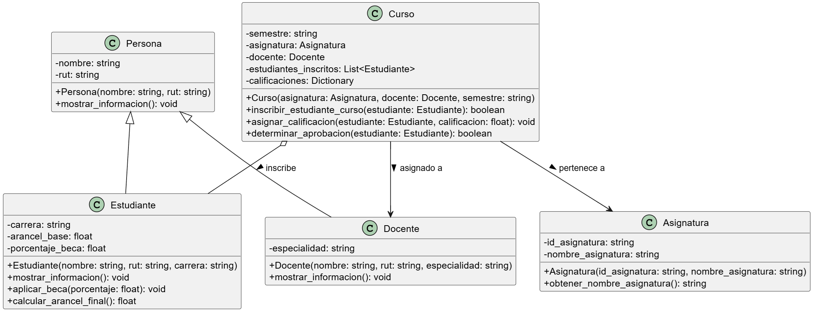

# Sistema de Gestión Académica Universitaria

## Descripción General
Gestionar la información académica y administrativa de una universidad. Permite la administración de estudiantes, docentes, asignaturas y cursos, abarcando procesos como inscripción, asignacion de calificaciones, validación de estados académicos y gestión de becas.

## Instrucciones de Ejecución
El sistema está diseñado para ejecutarse a través de la terminal. Para probar las funcionalidades principales, ejecuta el siguiente comando en la raíz del proyecto:

`CodigoS4.py`

## Lenguaje y tecnologías utilizadas 
Lenguaje: Python 3.14(64-bit)
Modelado: PlantUML (para diagrama de clases)

## Estructura del Proyecto
 `CodigoS4.py`: Contiene el código fuente completo del sistema, incluyendo las clases (`Persona`, `Estudiante`, `Docente`, `Asignatura`, `Curso`) y el bloque de ejecución principal.
 `Diagrama.puml`: Archivo con el código fuente del modelo UML.
 `DiagramaS4.png`: Imagen exportada del diagrama de clases estructural.

## Diagrama de Clases UML
